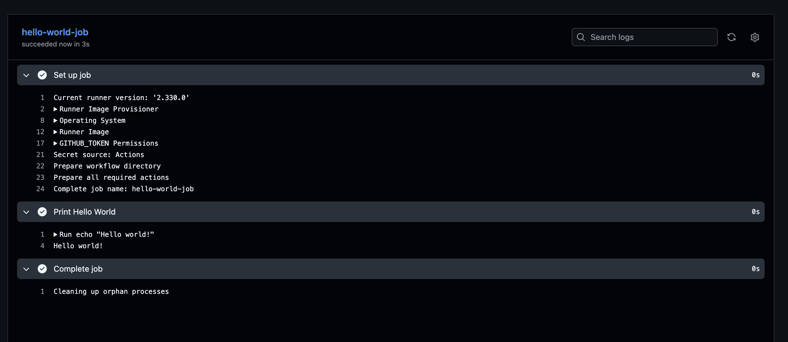
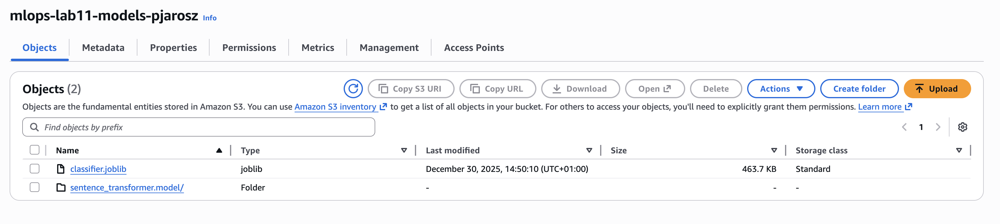
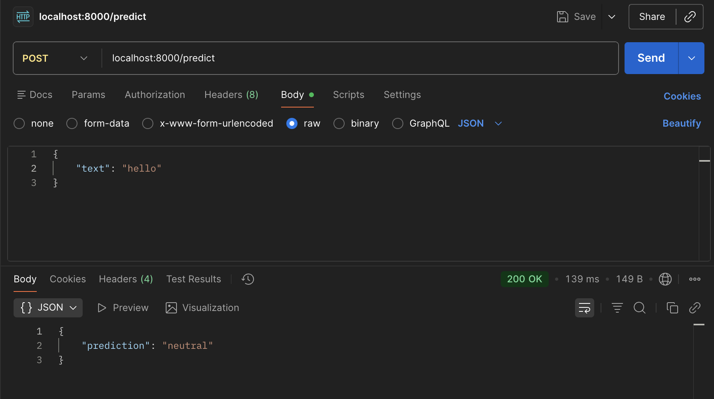
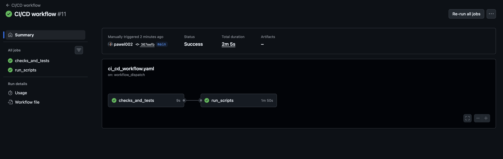
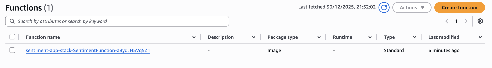
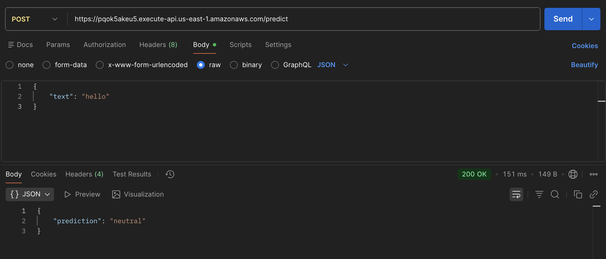

# mlops-ci-cd

I used my private AWS account because I used all the credits by mistake, therefore some parts of the CI/CD workflow are different.

### Hello world workflow

### Uploaded files to S3

### Working local container

### Successful github action (lab + homework)

### Lambda Created

### Lambda Handled a Request

